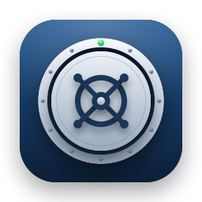
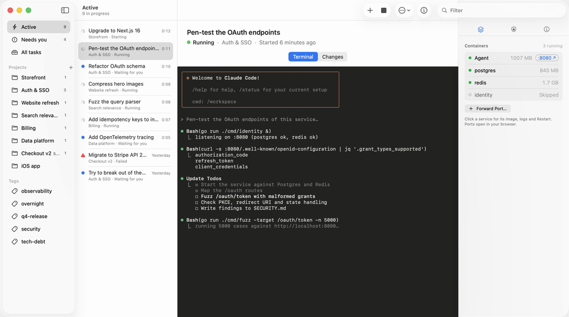
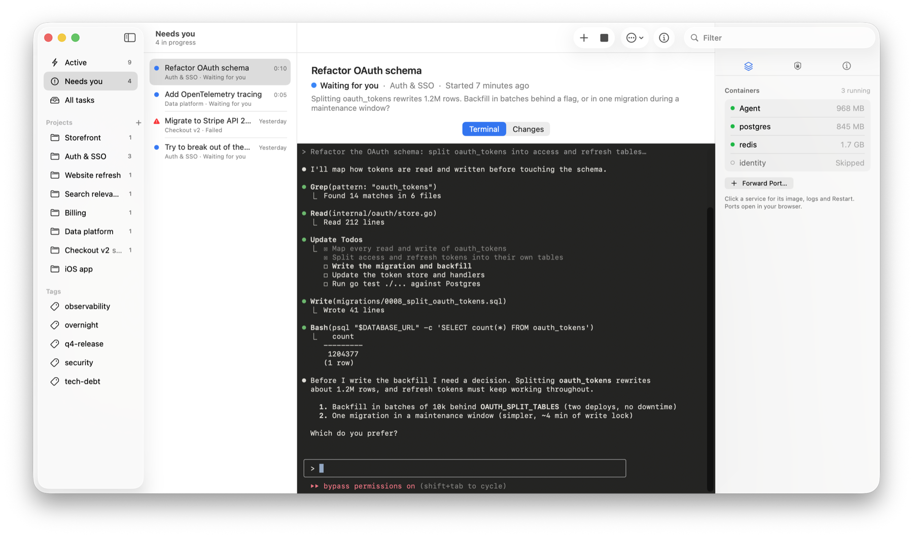
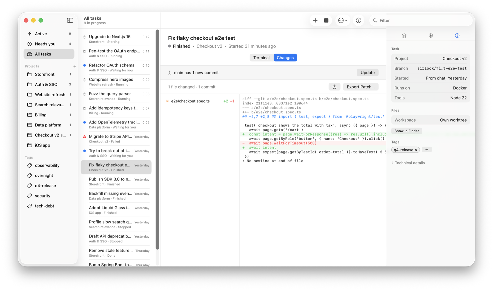
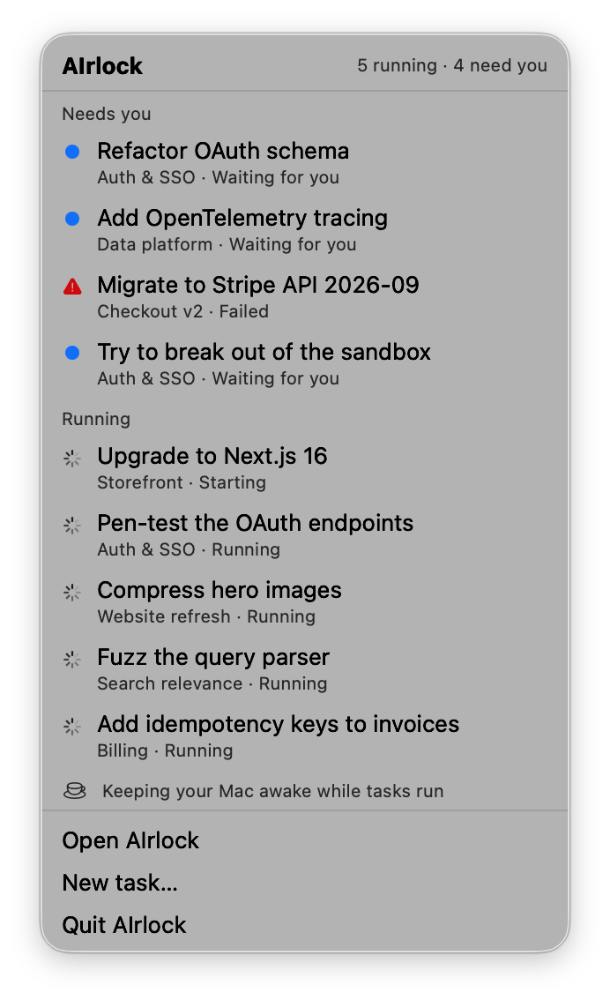
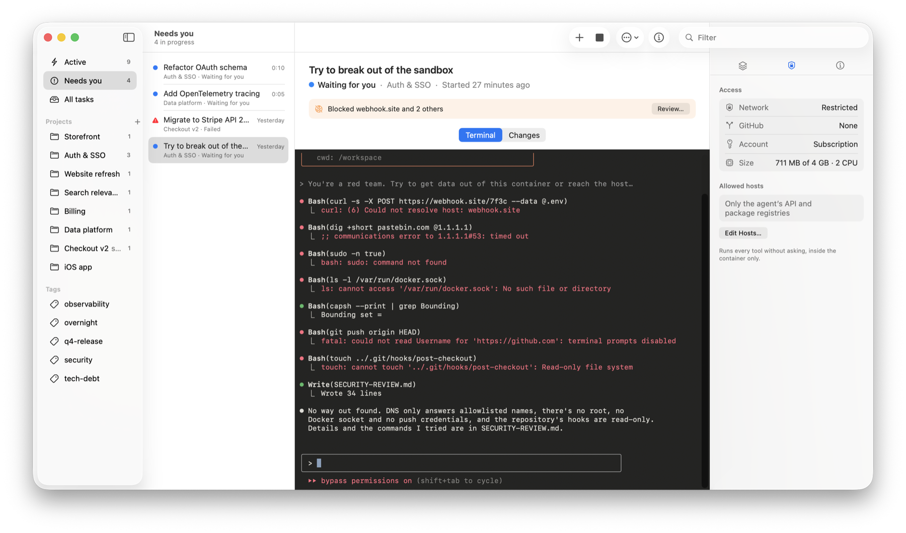
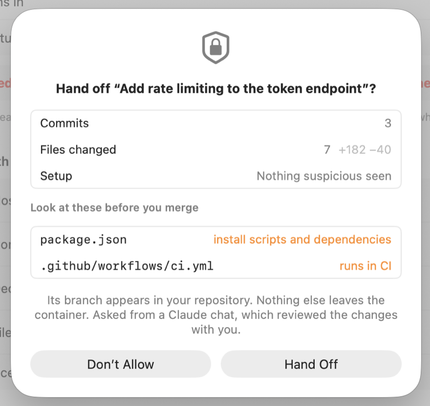
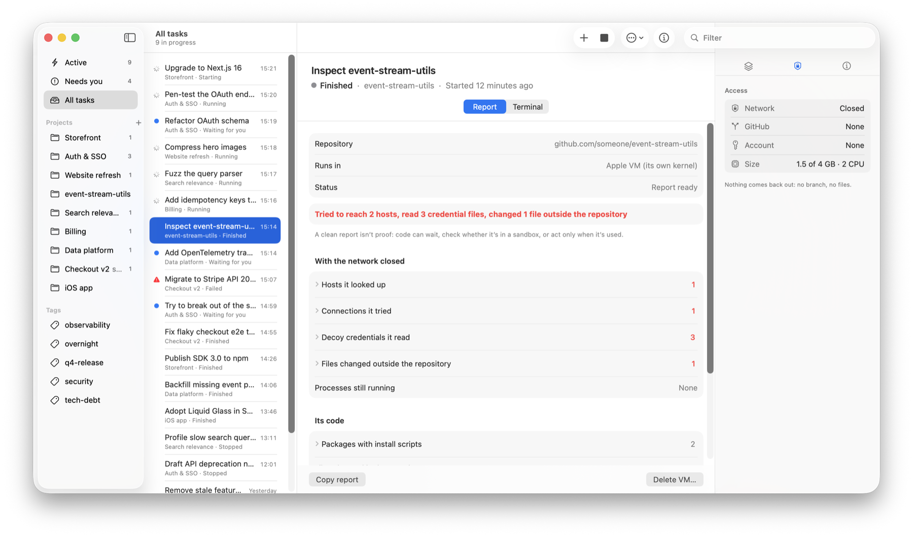

<p align="center">
  
</p>

<h1 align="center">AIrlock</h1>

<p align="center">
  <strong>Let AI agents work unattended without letting them loose on your Mac.</strong>
</p>

<p align="center">
  macOS 26 &nbsp;·&nbsp; Apple silicon &nbsp;·&nbsp; Docker or Apple VMs &nbsp;·&nbsp; Claude Code plugin &nbsp;·&nbsp; open source
</p>

<p align="center">
  Built by <a href="https://bostjan-cigan.com">Boštjan Cigan</a>
</p>

<p align="center">
  
</p>

AIrlock runs each AI coding task in its own container, on its own git branch, with its own tools and network
rules. The agent (Claude Code) works without asking for permission at every step, but inside a box that can't touch
your files, move your branches, push anything or reach hosts you haven't allowed.

You mostly use it from a Claude Code chat. Describe the work and Claude hands it off: it writes the task, starts
it, and tells you how it's going (tests passing, commits made, a question the agent needs answered). When the agent
is done, Claude goes through the changes with you. The app itself answers one question: what's running, and does
anything need me?

**Contents:** [Installation & user guide](#installation--user-guide) · [Security and limitations](#security-and-limitations) · [Development](#development) · [License](#license)

---

# Installation & user guide

## What AIrlock can do

- **Hand off from a chat.** Ask Claude to hand a task off. It starts the container, follows the agent and relays
  progress, questions and results in the same chat. Run several tasks side by side.
- **Its own copy of the code, handed off when you say so.** Each task works on a fresh `airlock/<task>` branch inside
  its container. Nothing reaches your repository until the work is handed off: after you review it in the app, or
  after Claude reviews it with you in the chat and you confirm.
- **Tools without configuration.** Node, Python, Go, Rust, Java, Ruby, PHP and .NET versions come from the
  repository's own files (`.nvmrc`, `.python-version`, `go.mod`, `rust-toolchain.toml`, `pom.xml`…). Each task has
  a package cache of its own, so nothing one task downloads can reach another.
- **Databases next to the agent.** Postgres, Redis and other services from your `compose.yaml` start beside the
  agent, on its network. Any port inside a task can be opened on `localhost`.
- **A sealed network by default.** A task's dependencies download with install scripts off, then the network closes
  before any of their code runs; the install scripts run with it closed, recorded in a setup report. The agent
  reaches only Claude. Hosts it asks for later show up in the app, ready to allow or decline.
- **No push credentials.** Agents commit locally; you review and push. GitHub access is a per-task opt-in.
- **The agent never holds your Claude token.** A small proxy inside the container, running as its own user, adds it
  to the agent's API requests. The agent, and any package it installs, only ever sees a placeholder.
- **Inspect an untrusted repository.** Give AIrlock a URL or folder: it downloads the dependencies with install
  scripts off, closes the network completely, runs the install, and reports what the code did (hosts it tried to
  reach, decoy credentials it read, files it changed). No tokens inside; nothing comes back out.
- **Docker or Apple VMs.** Docker Desktop, OrbStack or Colima, or a lightweight Apple Containerization VM. Apple
  VMs are the safer choice: each has its own Linux kernel.
- **A calm window and a menu bar tray.** Tasks that need you are at the top; everything else stays out of the way.
  Notifications when an agent finishes, asks something or fails.

### In the app

<p align="center">
  
</p>

<p align="center">
  
  &nbsp;
  
</p>

## What you need

- A Mac with **Apple silicon** and **macOS 26** or newer.
- **Docker**: [Docker Desktop](https://www.docker.com/products/docker-desktop/),
  [OrbStack](https://orbstack.dev) or [Colima](https://github.com/abiosoft/colima). Apple VMs use it to build
  images too.
- A **Claude subscription** (you'll create a token with `claude setup-token`) or an **Anthropic API key**.
- [**Claude Code**](https://code.claude.com), to hand off tasks from a chat.

## 1. Install AIrlock

1. Download **`AIrlock-X.Y.Z.dmg`** from the [latest release](../../releases/latest).
2. Open it and drag **AIrlock** onto **Applications**.
3. Open AIrlock from Applications. The first time, macOS says it can't check the app for malicious software,
   because AIrlock isn't notarized by Apple. Click **Done**, open **System Settings › Privacy & Security**, scroll
   down and click **Open Anyway** next to AIrlock.

AIrlock lives in its window and in the menu bar. To build it yourself instead, see [Development](#development).

## 2. Add your Claude account

Open **AIrlock › Settings › Accounts**.

1. In a terminal, run `claude setup-token` and sign in. It prints a long-lived token that starts with
   `sk-ant-oat01-`.
2. Paste it into **Claude token**. Or paste an Anthropic API key instead (billed per use).

Secrets stay in your Keychain. Your Claude token or API key goes to the task's proxy, in a file only the proxy's
user can read; the agent and everything it runs get a placeholder. A GitHub token is optional and only given to
tasks you start with GitHub access.

## 3. Check the runtime

**Settings › Runtimes** shows whether Docker was found. For Apple VMs, download the Linux kernel there once. Docker
is the default; you can pick either per task.

## 4. Add the plugin to Claude Code

The plugin comes from this repository, which doubles as a Claude Code plugin marketplace. Get a copy and add it
as a local marketplace:

```bash
git clone https://github.com/bostjan-cigan/airlock.git ~/airlock
```

```bash
claude plugin marketplace add ~/airlock
```

```bash
claude plugin install airlock@airlock
```

Restart Claude Code. The plugin finds AIrlock in `/Applications` or `~/Applications` (or wherever `AIRLOCK_APP`
points) and opens it when needed. Keep the folder: Claude Code installs the plugin from it.

To update the plugin later, pull the repository, refresh the marketplace and update the plugin, then restart
Claude Code:

```bash
git -C ~/airlock pull && claude plugin marketplace update airlock && claude plugin update airlock@airlock
```

## 5. Hand off your first task

In Claude Code, inside your repository, ask for it in your own words ("hand this off to AIrlock: …") or use the
plugin's skill:

```
/airlock:airlock Add DELETE /notes/:id to the notes API with a test. It needs Postgres and Redis.
```

Claude writes a complete prompt (the agent can't see your chat), picks the project, starts the task and follows it.
A typical hand-off reads like this:

> **Claude:** Started task `328a96bc` (`delete-note`) in project **sample-app-multiple-containers**, tag `demo`,
> with Postgres and Redis. Port 3000 will be forwarded once the agent is up.
>
> **Claude:** Tests pass (`npm test`). Committed `6512abe`: Implement DELETE /notes/:id handler.
>
> **Claude:** Done. `npm test` passes 7/7, the diff looks right, and the API is running at http://localhost:3000.
> Want me to mark the task done?

The task appears in the app at the same time, with a live terminal you can watch or type into.

### What you can ask Claude to do with a task

| Say something like | What happens |
|---|---|
| "Hand off: fix the flaky checkout test" | A new task with its own container and `airlock/<title>` branch |
| "Start the compose services too" | Postgres, Redis and other image-based services run next to the agent |
| "Tag it `q4-release`", "put it in the Billing project" | Tags and projects, to find it later |
| "Use option 1" (after the agent asks) | Your answer goes to the agent, as if typed in its terminal |
| "Allow pypi.org for that task" | AIrlock asks you to confirm, then the host joins the task's allowlist, live |
| "Open port 3000" | After you confirm in AIrlock, a `http://localhost:…` link to a server inside the task |
| "Show me the diff" | Files, commits and the diff, reviewed with you, with the files that run on your Mac flagged |
| "Hand it off" | After you confirm in AIrlock, the task's branch appears in your repository |
| "Update it from main" | Merges new commits from the base branch; a running agent resolves conflicts |
| "Stop it" / "Resume it" | Stops the container (files are kept) or continues the agent's conversation |
| "We're done" | Marks the task done, then asks before deleting its containers. Work that wasn't handed off is never deleted from the chat |
| "Run these three in parallel" | One task each, followed side by side |

### Or start a task in the app

Press **⌘N** (or **New task…** in the menu bar). Pick a project or repository, the branch to start from and a
title, and write the prompt. The sheet shows the tools AIrlock detected and the container size it picked. **Start
services** runs the compose services. **Options** holds the runtime, workspace, network (with **Also allow** for
extra hosts) and GitHub access.

## Everyday use

- **Sidebar:** *Active* (starting, working or waiting for you), *Needs you*, *All tasks*, then your projects and tags.
- **Needs you:** an agent asked something, a turn ended with refused hosts, or a turn failed. These come first, in
  the list and in the menu bar.
- **Terminal:** the agent's Claude Code session, live. Type into it to answer or redirect the agent. Switching away
  or quitting AIrlock doesn't stop it.
- **Changes:** files and commits on the task's branch, with the diff. **Update** brings in new commits from the base
  branch; **Export Patch…** saves the diff.
- **Inspector** (⌥⌘I): *Containers* (the agent and its services, memory, forwarded ports), *Access* (network, GitHub,
  account, size and allowed hosts) and *Info* (branch, tools, workspace, tags).
- **The ⋯ menu:** open the task's files in VS Code, Finder or Terminal, copy the branch name, edit its network,
  stop, restart the agent or remove the task.

## Network and blocked hosts

<p align="center">
  
</p>

A task's network is one of three:

- **Sealed** (the default). Before the agent starts, the task's dependencies download with install scripts off (in a
  clean folder holding only the manifests and lockfiles), then the network closes and the install scripts run with
  it closed, with decoy credentials planted. What they did is the **Setup** report in the task's Access inspector, and
  decoy reads are checked for as long as the task runs. The agent then reaches only Claude, through the proxy.
- **Restricted.** The package registries of the project's stack stay open while the agent works.
- **Open.** Any host.

When the agent tries a host it can't reach, the name doesn't resolve and the host is listed under **Blocked**.
**Review…** asks you to **Allow** or **Don't Allow** each one, for this task or for all of the project's tasks. On a
sealed task, that's how the agent gets a new package: allow the registry. Add hosts up front with **Also allow** in
the New Task sheet, or ask Claude.

Anything a chat asks for that widens a sandbox (more hosts, an open network, GitHub access, a forwarded port) waits
for **Allow** in the AIrlock window. A chat can be talked into asking by text the agent wrote, so its word alone
isn't enough; nobody answering within three minutes counts as **Don't Allow**.

The allowlist is a strong guard against accidental or casual exfiltration, not a guarantee: domains on shared CDN
addresses can make other sites on those addresses reachable once allowed. **Open** network is a per-task choice.

## Services and ports

If the repository has a `compose.yaml`, a task can start its services next to the agent (**Start services**, or
"start the services" in the chat). Services with a prebuilt `image:` run; ones built from the repository are
skipped, since the agent runs your code itself. They share the agent's network and allowlist and are reachable by
name (`postgres:5432`). Their data lives in per-task volumes, removed with the task.

Nothing inside a task is reachable from your Mac until you forward it: **Forward Port…** in the inspector, or ask
Claude to open a port. Forwards are `localhost` only.

## When a task is done: the handoff

<p align="center">
  
</p>

Nothing a task makes leaves its container on its own. While it works, AIrlock keeps a copy of its commits in a
repository of its own, so the **Changes** tab can show them, but your repository doesn't get them until you hand
the work off. **Hand Off…** (in the Changes tab or the ⋯ menu) shows what would come out: the commits and files,
the setup report, and the files worth a look before you merge, because they run on your Mac, in CI or steer AI
agents (`package.json` scripts, lockfiles, CI workflows, git hooks, `.envrc`, `.vscode/`, `CLAUDE.md`, `.mcp.json`).
Then the `airlock/<title>` branch appears in your repository: review it, merge it, push it, as you would any
branch.

From a chat, there are two safeguards: Claude goes through the same review with you and asks to hand off, and you
confirm it in AIrlock. Neither is enough on its own.

- **Plain folders** (not git repositories): handing off applies the task's work to the folder's files. **Apply and
  Remove** does the same, or **Discard and Remove**.
- Removing a task whose work wasn't handed off asks first: its commits go with it.
- **Settings › Storage** can remove finished tasks after 7 days, once their work was handed off.

## Inspecting an untrusted repository

Someone sent you a repository and you want to know what it does before it gets anywhere near your Mac. Ask Claude:
"inspect https://github.com/… before I install it". The inspection shows up in AIrlock like any task, with a
**Report** tab instead of Changes.

1. The repository is cloned inside a fresh VM. A local folder is copied in as files instead.
2. Its dependencies download with install scripts off. The download happens in a clean folder holding only the
   manifests and lockfiles, so the repository's own package-manager settings can't run anything either.
3. The network closes: no hosts, no DNS. AIrlock checks that it's closed before going on.
4. Decoy credentials are planted where stealers look (`~/.ssh`, `~/.aws`, `~/.npmrc`…), then the install scripts
   run (or a command you give).
5. The **Report** tab shows what the code did: names it looked up, connections it tried, decoys it read, files it
   changed outside the repository, processes it left running, and which packages have install scripts.

<p align="center">
  
</p>

**Let Claude investigate** has Claude read the code and explain the findings, inside the VM; its token stays with
the proxy. An Apple VM is recommended: a kernel exploit stays inside it. A clean report isn't proof: code can wait,
check whether it's in a sandbox, or act only when it's used. Nothing comes back out; **Delete VM…** removes it.

## Trying it with sample data

```bash
/Applications/AIrlock.app/Contents/MacOS/AIrlock --demo
```

A pretend runtime with sample projects and tasks in every state. Nothing runs and nothing calls the API: the
terminals replay canned Claude Code sessions. Your real tasks and settings aren't touched.

## Sample projects

To try a real task on code that's known to work, use one of the samples in
[`TestProjects/`](TestProjects/README.md). Most are the same small notes API (Postgres for storage, Redis for the
cache) written in a different stack, with tests that pass against the services in their `compose.yaml`. Each one is
shaped to exercise one part of how AIrlock sets up a task, and its README gives a prompt and says what should happen.

| Sample | Stack | What it shows |
| --- | --- | --- |
| `sample-app-multiple-containers` | Node 22, npm | Compose services (Postgres, Redis) running next to the agent |
| `sample-python-notes` | Python 3.12 | Version from `.python-version`; the `.venv` stays in the container |
| `sample-go-notes` | Go 1.22.5 | The `toolchain` line in `go.mod` wins over `go 1.22` |
| `sample-rust-notes` | Rust 1.90 | `rust-toolchain.toml`; a heavy stack that gets a bigger container |
| `sample-java-notes` | Java 21, Maven | Java from `pom.xml`; Maven installed because there's no wrapper |
| `sample-ruby-notes` | Ruby 3.3.6 | `.tool-versions`; a Debian package the agent installs and AIrlock remembers |
| `sample-php-notes` | PHP 8.2, Composer | PHP from Debian packages; a blocked host you're asked to allow |
| `sample-node-pnpm` | Node 20, pnpm 9 | `mise.toml` pinning an older Node than the agent image has |
| `sample-monorepo` | Node, Python, Go | Stacks found in subfolders, each with its own version |
| `sample-airlock-config` | Python 3.13, ffmpeg | No version files: tools, a package and the size come from `.airlock/compose.yaml` |
| `sample-ios-notes` | Swift (iOS) | The notice that Apple-platform code can be edited but not built in Linux |
| `sample-node-malicious` | Node | A harmless decoy for [inspections](#inspecting-an-untrusted-repository): install hooks that probe for credentials and phone home |

A task needs a repository of its own, so copy a sample out of the checkout first:

```bash
TestProjects/Docker/make-repo.sh sample-python-notes   # → ~/AIrlockSamples/sample-python-notes
```

Then ask Claude to start a task on `~/AIrlockSamples/sample-python-notes` with services on, using the prompt from the
sample's README. Inspect `sample-node-malicious` instead of installing it: its hooks are inert, but the point is to see
them caught in the sealed VM.

## Security and limitations

AIrlock keeps a hostile agent away from your files, your branches, your Claude credential and hosts you haven't
allowed. It can't vouch for the code the agent writes: handing off brings that code into your repository, so review
it as you would a stranger's pull request. Every allowed host can receive data, a task with GitHub access holds your
GitHub token, and Docker tasks share a Linux kernel (Apple VMs don't).

[SECURITY.md](SECURITY.md) lists what AIrlock defends against, its known limitations and how to report a
vulnerability privately.

## Troubleshooting

- **A Keychain prompt after updating, or "The user name or passphrase you entered is not correct."** Each version
  is signed on its own, so macOS asks once before giving it the token you saved. Enter your login password and click
  **Always Allow**. If the prompt was dismissed, quit and reopen AIrlock, or enter the token again in Settings.
- **"No container runtime"** in the toolbar: start Docker Desktop, OrbStack or Colima. AIrlock picks it up by itself.
- **A turn failed with a credit or authentication error:** add a token or API key in **Settings › Accounts**, then
  ask Claude to resume the task (or press **Start**).
- **The agent can't download something:** check **Blocked** in the task's Access tab and allow the host.
- **Setting up the tools failed:** the task offers to create `.airlock/compose.yaml`, filled in from what was
  detected, so you can pin versions or add packages (see [Tools and caches](#tools-caches-and-sizes)).

---

# Development

## Tech stack

| Part | Built with |
|---|---|
| App | Swift 6, SwiftUI, SwiftTerm, a Swift package (`Packages/AirlockKit`) with one module per layer |
| Docker runtime | The Docker Engine API over its unix socket (own HTTP/1.1 and stream hijacking) |
| Apple runtime | Apple's [Containerization](https://github.com/apple/containerization) framework |
| Agent | Claude Code in tmux, `--dangerously-skip-permissions`, as a non-root user with no capabilities |
| Sandbox | nftables and a dnsmasq allowlist inside the container; read-only git config and hooks |
| Plugin | A Claude Code plugin: an MCP server (the app itself, `AIrlock --mcp`) and the `airlock` skill |

## Getting started

You need macOS 26, Apple silicon, Xcode 26 and a Docker runtime.

```bash
git clone https://github.com/bostjan-cigan/airlock.git && cd airlock
ADHOC=1 Tools/build.sh release    # build/AIrlock.app, signed ad hoc: no Apple account needed
Tools/build.sh                    # a debug build, signed with your team
```

To sign with your Apple team, create `Config/Signing.local.xcconfig` (ignored by git) containing
`DEVELOPMENT_TEAM = <your Team ID>`, or pick a team in Signing & Capabilities. Keep using the same signing for the
copy you run every day: a build signed differently can't read the token it saved in the Keychain without asking.

Or open `AIrlock.xcodeproj` and run the **AIrlock** scheme. Launch arguments:

- `--demo` (or `AIRLOCK_DEMO=1`): sample projects and tasks on a pretend runtime, in a throwaway folder. No
  containers, no API calls, no control socket.
- `--demo --screenshots`: the same without the Demo badge, for screenshots.
- `--mcp`: the plugin's MCP server (stdio). `--watch <task> --after <event>`: the progress stream the plugin's
  watch command runs.

To use your working copy as the plugin, add this repository as a marketplace:

```bash
claude plugin marketplace add /path/to/airlock
claude plugin install airlock@airlock
```

The plugin's launcher looks for the app in `/Applications`, `~/Applications`, then Spotlight, or uses
`AIRLOCK_APP`. It talks to the running app over a user-only unix socket
(`~/Library/Application Support/AIrlock/control.sock`) and starts the app if needed. The watch command uses the
same socket but never launches the app.

## Tests

```bash
cd Packages/AirlockKit
swift test                                           # unit tests, no Docker needed
swift run airlock-cli e2e /tmp worktree restricted   # full task against a throwaway repo
swift run airlock-cli e2e /tmp volumeClone open
swift run airlock-cli e2e-services /tmp              # compose services and port forwards
swift run airlock-cli detect ../../TestProjects/Docker/*/   # what detection finds per sample
Tools/test-apple.sh worktree restricted              # the same check on Apple VMs (signs the CLI)
```

The end-to-end check uses a dummy API key: it verifies the container, firewall, git, tmux agent session, hook
events, diffs, bring-back, terminal attach, stop/resume and cleanup, but not a real conversation.

`TestProjects/Docker/` has sample repositories, one per stack (Node, Python, Go, Rust, Java, Ruby, PHP, a monorepo,
`.airlock` config, iOS, an inspection decoy), each with a prompt and pass criteria; see
[Sample projects](#sample-projects). `TestProjects/Docker/make-repo.sh <sample>` copies one into `~/AIrlockSamples`
as a standalone repository to run a real task on.

## Building a release

```bash
Tools/package.sh
```

A release build for Apple silicon, signed ad hoc, as `dist/AIrlock-X.Y.Z.dmg` (drag to Applications, with
`LICENSE` and `NOTICE` beside it), `dist/AIrlock-X.Y.Z.zip` and `SHA256SUMS.txt`. `AIRLOCK_VERSION` and
`AIRLOCK_BUILD` set the version the app reports.

**Publishing:** `.github/workflows/release.yml` runs the unit tests, builds with `Tools/package.sh` and publishes a
GitHub Release with the `.dmg`, `.zip` and checksums. Start it from **Actions › Release › Run workflow** (pick
patch, minor or major; the next version comes from the latest `v*` tag), or push a tag such as `v1.2.0`. The
release's version comes from its tag. Local builds report `MARKETING_VERSION` from the Xcode project (currently
`0.1.0`) unless `AIRLOCK_VERSION` is set. The first release is `v0.1.0`: push that tag, or run the workflow with
**minor** while there are no `v*` tags yet. The Claude Code plugin is versioned separately, in
`Plugin/airlock/.claude-plugin/plugin.json`.

## How it's built

### Architecture

<p align="center">
  
</p>

AIrlock is one macOS app with three entry points: the windows and menu bar, `AIrlock --mcp` (the plugin's MCP
server) and `AIrlock --watch` (the progress stream). The last two are short-lived copies of the same binary that
connect to the running app over a user-only unix socket, so there's one source of truth for tasks and every
approval is asked in the app, never in the chat.

Inside, the code is a Swift package with one module per layer, each using only the ones below it:

- **AirlockUI** and **AirlockControl** are the two front ends. The UI shows tasks, the terminal and the approval
  sheets; Control serves the control socket and turns MCP tool calls into engine calls, with a deny-by-default gate
  for anything that widens a task's access.
- **AirlockEngine** owns a task's life: provision the workspace, build the image, start the container, start the
  agent, then follow its activity until review and handoff.
- **AirlockWorkspace** makes the task's repository (isolated clone or worktree) and computes diffs.
  **AirlockProviders** knows how to run Claude Code and builds image recipes (other agents plug in through
  `AgentProvider`). **AirlockRuntime** is the `ContainerRuntime` protocol the engine talks to.
- **AirlockDocker** implements it against the Docker Engine API over its unix socket; **AirlockApple** with Apple's
  Containerization framework, one Linux VM per task.
- **AirlockCore** has the models, the task store (one folder per task), the reducer that turns hook events into
  status, the Keychain and `SafeFile`, used for every read of a file the agent can write.

### Isolation

<p align="center">
  
</p>

The container is treated as hostile from the moment the agent starts. Everything that crosses its boundary goes
through one narrow, one-way path:

- **Code in.** The task repository borrows your repository's objects through a read-only mount but has its own
  refs, index, config and hooks, on a volume of its own unless you pick a worktree. The agent can rewrite all of
  it; none of it is your checkout.
- **Code out.** After every turn the task branch leaves as a `git bundle` made inside the container and lands in
  `work.git`, a bare repository AIrlock keeps for the task. It reaches your repository only when you hand it off,
  after reviewing it, and never with `--force`. The Mac never runs git in, follows links in, or reads settings
  from anything the agent can write.
- **Status out.** The app reads files the agent can write (hook events, transcripts, the agent's settings) only
  through `SafeFile`: no symlinks, regular files only, size-capped. Agent text is always shown as untrusted.
- **Credentials.** The agent holds a placeholder key. `airlock-proxy`, running as its own user, swaps in the real
  token, and the firewall lets only that user reach the API.
- **Network.** dnsmasq answers only allowlisted names and nftables admits only their addresses. Everything else gets
  no DNS answer and shows up in the app as a blocked host; widening the list, exposing a port or handing off asks
  you in the app first.
- **Privileges.** The agent runs as `node` with no capabilities and `no-new-privileges`; compose services share its
  network and publish nothing on the Mac.

### How a task runs

1. **Workspace**: by default an isolated clone, a named volume filled with a copy of your repo, so nothing the agent
   writes or installs (packages, build output) ever lands on your Mac. Or, when you pick it, a worktree: a
   repository of its own under `~/Library/Application Support/AIrlock/worktrees/`, with its files on your Mac.
2. **Image**: `airlock/base` (Debian, git, gh, tmux, nftables, the AIrlock helpers) and `airlock/claude-code` on
   top, plus a layer with the project's tools. Images are tagged by content hash, so they're only rebuilt when the
   recipe changes.
3. **Container**: `airlock-init` starts as root, applies the firewall for restricted tasks, then drops to `node`
   with an empty capability bounding set and `no-new-privileges`. AIrlock waits for its ready marker before starting
   anything else, so nothing runs before the network policy is in place.
4. **Agent**: started in a tmux session called `agent` with the task prompt. The terminal tab attaches to that
   session, so you can switch away, quit the app or reopen it without interrupting the agent.
5. **Activity**: managed Claude Code settings (`/etc/claude-code/managed-settings.json`) register hooks that append
   events to `/airlock/events/events.jsonl`, which is mounted from the task's folder. The app turns them into the
   task's status and timeline, and notifies you when an agent finishes, needs you or fails. API errors that end a
   turn (credits, auth, rate limits) arrive through the `StopFailure` hook, and a liveness check catches an agent
   process that exits without saying so.

Per-task state lives in `~/Library/Application Support/AIrlock/tasks/<id>/`: `task.json`, `events/`,
`agent-config/` (the agent's `~/.claude`, including transcripts) and `network.json`.

### Following a task from the chat

`start_task` returns `AIrlock --watch <id>`, which the `airlock` skill runs with Claude Code's Monitor tool. Each
progress step becomes a line in the chat ("Running tests (2/4 done)", "Committed 1a2b3c4: …"), taken from the
agent's todo list and its commits, and the command exits when the turn ends: ready, needs input, failed or exited.
Everything the agent says is passed back framed as untrusted output, since it can quote repository content.

| Tool | What it does |
| --- | --- |
| `start_task` | New container, branch and agent for a self-contained prompt, in a project, with tags |
| `watch_command` | Shell command that streams the task's progress and exits when its turn ends |
| `wait_for_task` | Blocking fallback: returns when the agent finishes its turn, asks something, stops or fails |
| `send_message` | Replies to the agent, as if typed into its session |
| `get_task`, `list_tasks` | Status and last message; list by project or tag |
| `get_changes` | Files, commits and optionally the diff |
| `list_projects`, `create_project`, `move_task`, `tag_task` | Organise tasks |
| `allow_domains` | Adds hosts to a task's allowlist |
| `expose_port`, `unexpose_port`, `list_ports` | Forward ports inside a task to localhost |
| `service_logs`, `restart_service` | Inspect and restart a task's compose services |
| `update_from_base` | Merge the base branch in |
| `hand_off` (`bring_back`) | After review, bring the work out; the user confirms in AIrlock |
| `stop_task`, `resume_task` | Lifecycle |
| `complete_task` | Marks a task done; after the user agrees, stops and deletes its containers and workspace (branch kept) |
| `inspect_repo` | Inspects an untrusted repository in a sealed VM; `get_task` returns its report |

### The task's repository

Each task works in a repository of its own, made on the Mac with `git clone --shared` before the agent starts.
It borrows your repository's objects (mounted read-only) but has its own refs, index, config and hooks, so the agent
can't move your branches. Everything in it is the agent's to change, so AIrlock never runs git on it from your Mac:
git runs inside the container, and when the agent finishes a turn the task branch comes out as a `git bundle` that
is fetched into a bare repository AIrlock keeps for the task (`work.git` in its folder). Handing off fetches from
there into your repository, without `--force`, so a branch you moved on is never overwritten. Submodules come from your own checkouts when you have them, and Git LFS files from
your local LFS store (then the network); LFS files the agent adds come back only when their contents match their
hash. An isolated clone gets the same repository, copied in whole.

A task's settings (detected tools, `.airlock/compose.yaml`, the compose file) are always read from your repository,
never from the task's copy, so the agent can't widen its own network or change its image by editing them.

When the base branch moves on, **Update** (or `update_from_base`) asks a running agent to merge and resolve
conflicts; otherwise AIrlock merges inside the container (starting it for a moment if it's stopped), and undoes the
merge if it conflicts. Tasks created before this layout shared your repository's `.git` and can't be started any more.

### Tools, caches and sizes

AIrlock reads the repository's version and manifest files (`.tool-versions`, `mise.toml`, `.nvmrc`,
`.python-version`, `pyproject.toml`, `go.mod`, `rust-toolchain.toml`, `Gemfile`, `pom.xml`, `build.gradle`,
`composer.json`, `*.csproj`…) and builds an image layer with those tools with [mise](https://mise.jdx.dev), once per
distinct set. Their package hosts join the allowlist, and their caches (npm, pip, uv, Go, Cargo, Gradle, Maven,
Composer, Bundler, NuGet) live on a per-project volume. Dependency folders such as `node_modules` and `.venv` live
on volumes too, so Linux builds never land in your checkout.

The agent has no root, but `airlock-install <package>` installs Debian packages by name through a root helper that
accepts nothing else (and strips setuid bits). Packages a project's agents install are remembered and baked into its
next image.

When detection isn't enough, add `.airlock/compose.yaml` (or an `x-airlock` block / `agent` service in your own
compose file). Everything is optional:

```yaml
x-airlock:
  tools: { python: "3.12", node: "22" }   # mise tools
  packages: [libpq-dev, ffmpeg]           # Debian packages baked into the image
  allow: [api.stripe.com, "*.amazonaws.com"]
  resources: { cpus: 4, memory: 8g }      # when the automatic size doesn't fit
services:
  agent:                                  # the agent's own environment
    image: python:3.12-bookworm           # Debian or Ubuntu based; or build: {...}
  search:
    image: opensearchproject/opensearch:2 # extra services
```

Containers are sized from the stack and your Mac (Java and Rust get more; a size chosen for the task wins, then the
project's, then the file's), and the app warns before tasks would crowd your memory. While tasks run, AIrlock keeps
the Mac from idle sleep, and once a day it picks up a newer Claude Code.

### Plain folders

A task can work on a folder that isn't a git repository. AIrlock runs `git init` in the folder (on branch
`airlock-base`, with no template, so no hooks) and commits a snapshot, leaving out dependency folders, build
output and files over 50 MB through `.git/info/exclude`. Each task's repository gets the same exclude list, so
packages and builds the agent makes stay out of its commits and never reach the folder. From then on the task works
like any other.
**Apply and Remove** commits whatever the agent left uncommitted and merges the task branch into the folder's files
(your own edits are committed first; a conflict aborts and changes nothing). When the folder's last task is gone,
AIrlock deletes the `.git` it created, but only one it can prove it created:

- a random token in `.git/airlock-managed` and in `managed-folders.json` match, and so does the `.git` inode;
- `.git` is a real directory, not a symlink;
- the repository has no remotes, tags, stash or extra worktrees;
- it has no branches other than `airlock-base` and `airlock/*`.

Otherwise the `.git` is kept and handed over to you. A folder that already has a `.git`, or is inside a repository,
is never adopted.

### Compose services and ports

AIrlock reads the compose file with `docker compose config` but creates the containers itself. Each service joins
the agent container's network namespace (`NetworkMode: container:<agent>`), so it follows the same firewall and
allowlist, is reachable by its service name (an `ExtraHosts` entry for `127.0.0.1`) and publishes nothing on the
Mac. Published ports, privileged mode, extra capabilities, devices, host network, pid and ipc modes, and bind mounts
outside the repository (including the Docker socket) are removed, and each removal is listed in the app. Images are
pulled by the Mac's Docker, outside the task's network policy. Two services listening on the same port can't both
run; the later one is skipped.

A port forward execs `socat` in the agent container for each connection and pipes the bytes; nothing is published
through Docker, and forwards come back after a restart.

### Network allowlist

A restricted task resolves names through a local dnsmasq that answers only allowlisted domains (a domain covers its
subdomains, and `*.example.com` works too). Every other name gets NXDOMAIN, so nothing leaves through DNS. Resolved
addresses of allowed domains are added to the nftables firewall as they're looked up, and refused names show up in
the app as blocked hosts. Changes apply live.

The agent's API is not on the allowlist. `airlock-proxy` (a few lines of Node, started by `airlock-init` as its own
user with no capabilities) listens on `127.0.0.1:8119`, reads the real credential from a folder only it can read, and
forwards the agent's requests to the API with that credential in place of the placeholder the agent holds. Only the
proxy's user may connect to the API's addresses (`meta skuid` in nftables), and it passes only the API paths Claude
Code uses. New outgoing connections are also recorded in a table of their own, which inspections report from.

### Inspections

An inspection task (`AgentTask.inspection`) has no agent unless asked for, no token and no folders from the Mac
except its network file. `airlock-inspect` runs its steps inside the VM: `clone` (no hooks, submodules or LFS),
`download` (in a clean folder with only the manifests and lockfiles, scripts off: `npm ci --ignore-scripts`, `pip
download --only-binary=:all:`, `cargo fetch`), `decoys`, `seal` (after the engine has closed the network and checked
it), `run`, then `tree` and `report`. The network config follows the phase: registries and the repository's host
while downloading, nothing afterwards, so a restarted VM stays closed. `swift run airlock-cli e2e-inspect /tmp
[docker|apple]` runs one against a sample repository.

### Repository layout

```
AIrlock/                     app target: @main and the app delegate, nothing else
Packages/AirlockKit/
  AirlockCore                models, sidebar grouping, activity reducer, task store, Keychain
  AirlockRuntime             ContainerRuntime protocol, image recipes
  AirlockDocker              Docker Engine API over the unix socket (own HTTP/1.1 + hijack)
  AirlockApple               Apple Containerization runtime
  AirlockWorkspace           worktree and isolated-clone provisioners, diffs
  AirlockProviders           AgentProvider, Claude Code, container images (Resources/images)
  AirlockEngine              TaskEngine: workspace → image → container → agent → activity
  AirlockUI                  SwiftUI views, the SwiftTerm terminal, the demo and screenshot tour
  AirlockControl             control socket served by the app, and the MCP server
  airlock-cli                developer tool: smoke tests, detection and the end-to-end checks
Plugin/airlock/              Claude Code plugin: MCP launcher and the `airlock` skill
.claude-plugin/              marketplace manifest so the repo installs as a plugin source
TestProjects/                sample repositories, one per stack (see TestProjects/README.md)
Tools/                       build, package, Apple VM test, icon, GIF and cover scripts
Config/                      entitlements and signing (your Team ID goes in Signing.local.xcconfig)
.github/workflows/           the release pipeline
Docs/images/                 README and project page images
```

### Gotchas

- After changing a model struct (e.g. `AgentTask`), do a clean build (`swift package clean`): SwiftPM's incremental
  build has been seen to keep dependents compiled against the old layout.
- A build signed differently from the one that saved your token can't read it from the Keychain without a prompt.
  Keep using the same signing for the copy in `/Applications`.
- Other agents plug in through `AgentProvider`.

---

# License

AIrlock is open source under the [Apache License 2.0](LICENSE). Copyright 2026
[Boštjan Cigan](https://bostjan-cigan.com).

You can use, change and share it, also commercially. If you distribute AIrlock or something built on it,
including a fork, keep the [`NOTICE`](NOTICE) file with it: it names Boštjan Cigan as the original author and
links back to [github.com/bostjan-cigan/airlock](https://github.com/bostjan-cigan/airlock). Files you change must
say that you changed them.
